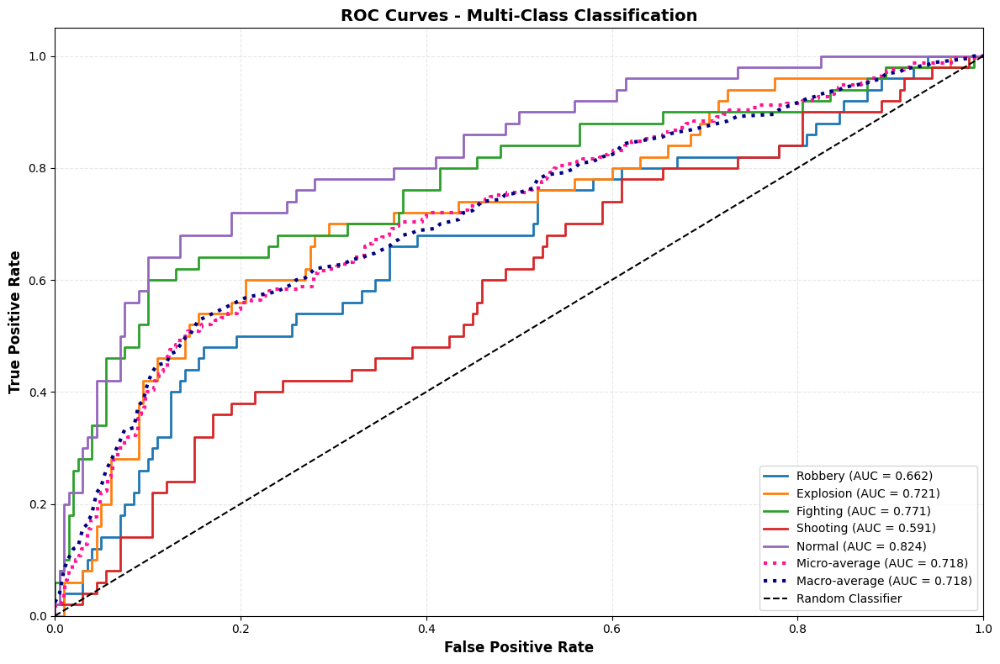
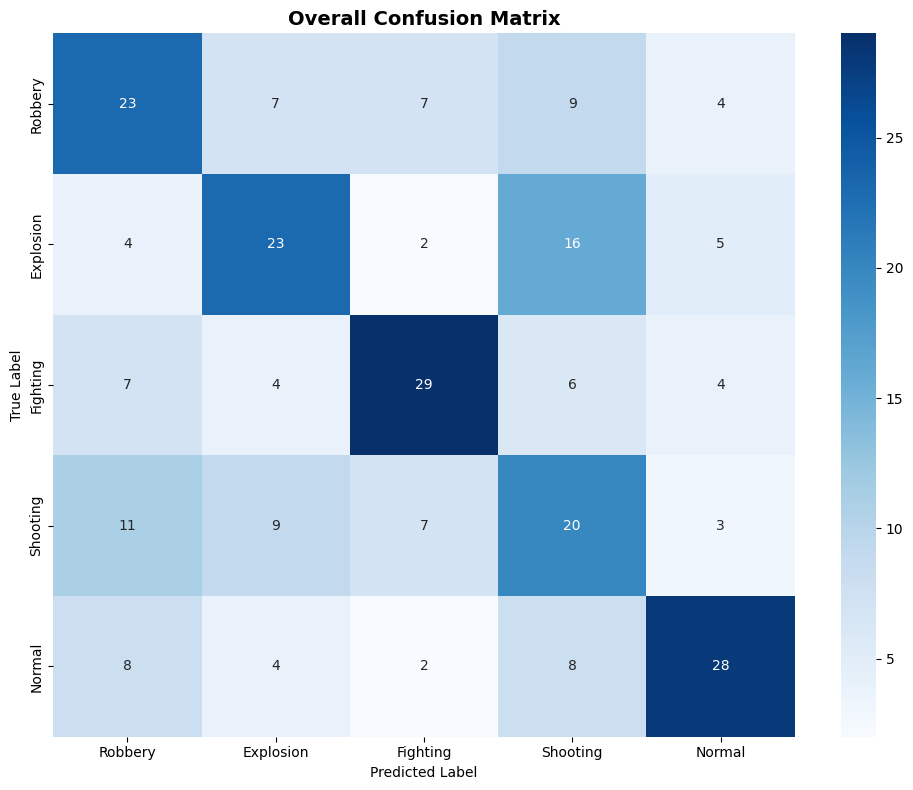
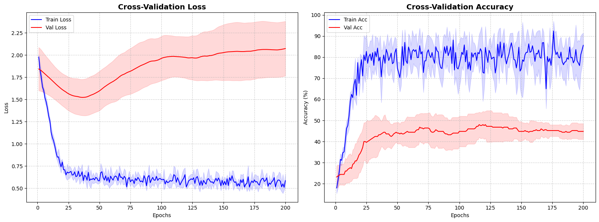

# Real-Time-Smart-Surveillance-System-with-Anomaly-Detection

This repository contains a simple, yet functional, prototype for a real-time human anomaly detection and tracking system in crowded environments. The system is designed to identify and follow individuals whose behavior deviates from a learned "normal" pattern.

The project is built on a two-stage pipeline:

1. **Perception:** Detect and track individuals in a video stream.  
2. **Analysis:** Analyze their movement for anomalous behavior.

---

## Core Technologies

- **Object Detection:** YOLOv8, a state-of-the-art model for real-time object detection.  
- **Multi-Object Tracking:** DeepSORT, a robust algorithm that maintains unique IDs for individuals across frames, even during occlusions.  
- **Anomaly Detection:** An Autoencoder model, which is a neural network trained to recognize "normal" patterns. It identifies anomalies by failing to reconstruct a pattern it has never seen before, using the reconstruction error as an anomaly score.  
- **Development Framework:** PyTorch for building and training the anomaly detection model.  
- **Video Processing:** OpenCV for handling video I/O.  

---

## Getting Started

These instructions will get you a copy of the project up and running on your local machine for development and testing purposes.

### Prerequisites

First, ensure you have Python 3.8+ installed on your system. It is highly recommended to use a virtual environment to manage project dependencies.

#### Create a virtual environment
```bash
python3 -m venv venv
```

#### Activate the virtual environment

##### On macOS/Linux:
```bash
source venv/bin/activate
```
#### On Windows:
```bash
venv\Scripts\activate
```

### Installation

Clone this repository to your local machine:
```bash
git clone https://github.com/your-username/your-repository-name.git
cd your-repository-name
```

Install the required Python packages:
```bash
pip install -r requirements.txt
```

## Usage

To run the end-to-end prototype, you will need a video file for testing. The code is configured to use a video file named your_video.mp4 in the project directory.
```bash

Download a video clip you like to test or you can use the live video footage.

Place the video file in your project's root directory.

Rename the video file to your_video.mp4 or update the cv2.VideoCapture('your_video.mp4') line in the main.py script.

Run the script from your terminal:

python main.py
```
The system will open a video window displaying the real-time detection, tracking, and anomaly status for each person. Press q on your keyboard to exit the program.


## Project Structure
```bash
main.py: The main script that runs the end-to-end prototype.

requirements.txt: Lists all Python dependencies.

.gitignore: Specifies files to be ignored by Git.

README.md: Project description and instructions.
```
##Visuals





